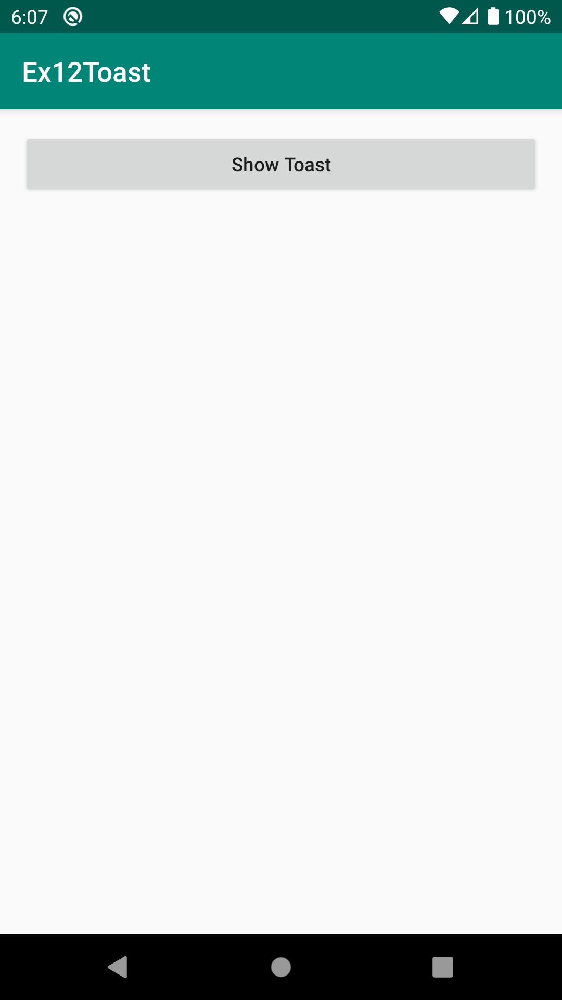
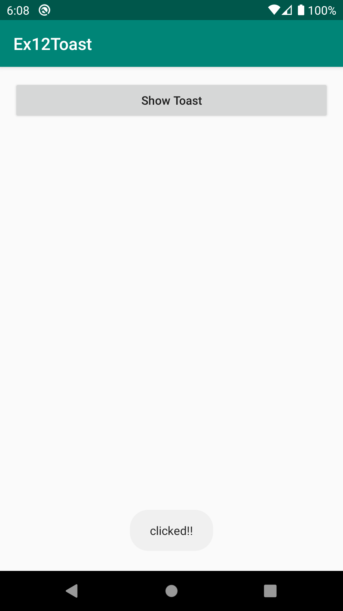
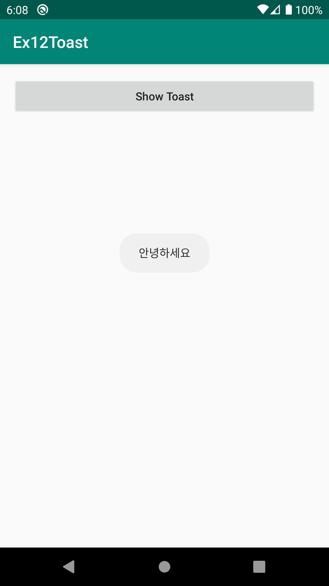
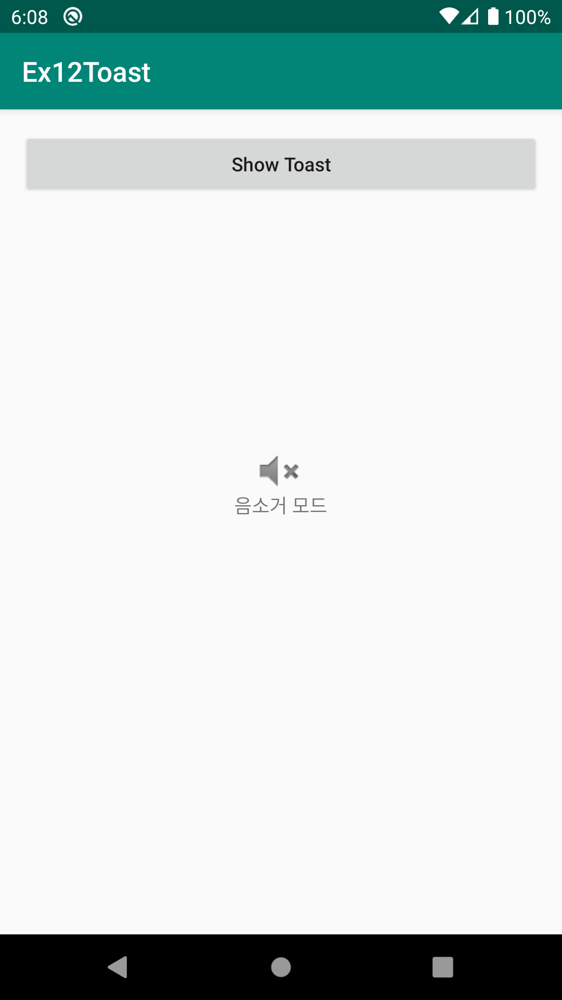
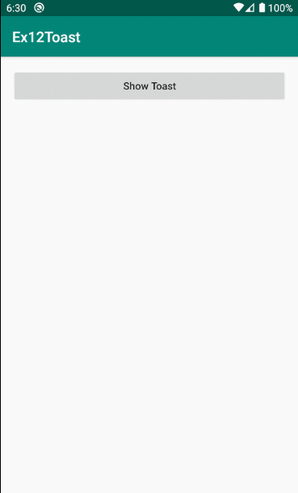

# Ex12Toast
안드로이드 네이티브 앱 개발 수업 예제#12

# 주요코드
Toast 객체 생성 및 보이기와 위치설정 알아보기

- 버튼을 클릭하여 기본적인 String메세지를 보여주는 토스트 객체 생성 및 보이기
- 토스트에서 보여줄 String메세지를 res폴더>>values>>strings.xml문서안에 만들고 토스트에서 보여주기
- 토스트가 보여지는 위치를 설정하기 (Gravity설정 및 xOffset, yOffset소개)
- 토스트에 단순 문자열이 아닌 원하는 모양의 View 보여주기 
  1) Java언어만으로 원하는 View모양 만들기[ res폴더>>layout폴더>>toast.xml문서 ]
  2) XML로 View객체 생성하고 적용하기 : layout폴더 안에 있는 toast.xml이라는 문서를 읽어서 View객체로 만들어(부풀려주는 inflate) 주는 LayoutInflater 객체소개

# 실행모습

  <h4>1.기본 Toast, 2.Toast 위치지정, 3.Custom View Toast</h4>  
  
  
  
  

# 실행모습 GIF

  

